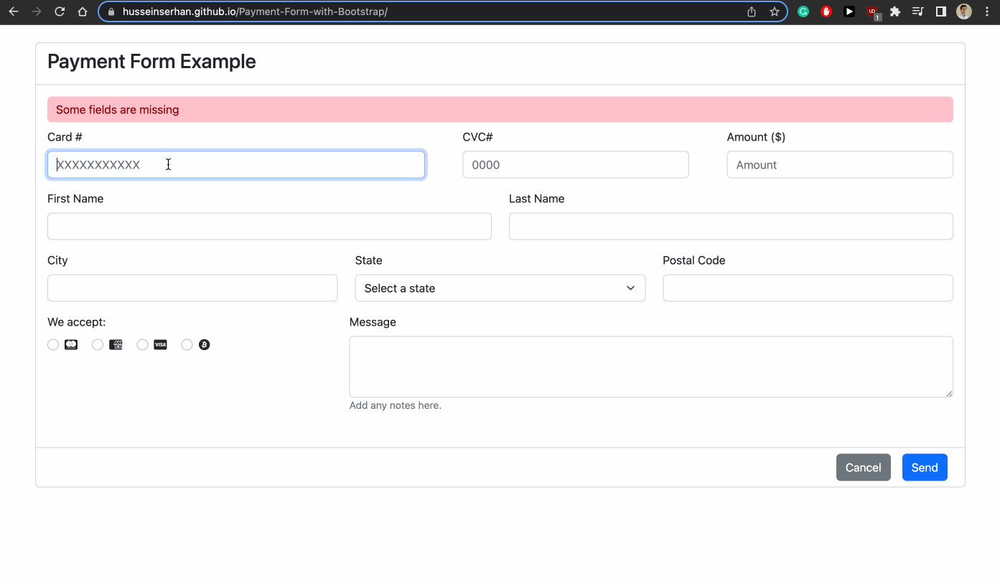

# Payment Form with Bootstrap

This project is a payment form built using Bootstrap. The form includes various input types such as text, form-check-input, and number, and has been validated according to HTML5 standards.

## Getting Started

You can view the payment form at https://husseinserhan.github.io/Payment-Form-with-Bootstrap/

## Guidelines Followed

To ensure that the inputs are being used properly, I made sure to include the correct input type for each field. I used select and option tags to build a menu with multiple states as options and input tags with the type="radio" attribute, class="form-check-input" and name="payment-method" to allow the user to only pick one payment method (visa, amex, mastercard, and bitcoin).

In addition, I used the HTML5 validation features such as the required attribute to validate the form inputs. This ensures that all required fields are filled in.

I also made use of Bootstrap's classes to style the form. This allowed me to focus on building a layout strategy by identifying the various div boxes and using display: flex for those divs that needed to be laid out horizontally.

## Technologies Used
The payment form was built using the following technologies:

HTML5
CSS3
Bootstrap 5.2

## Conclusion

Building a payment form using Bootstrap 5.2 allowed me to practice using various input types and HTML5 validation features, as well as familiarize myself with Bootstrap's classes for styling forms. Overall, this project helped me improve my front-end development skills and understanding of web design principles.
